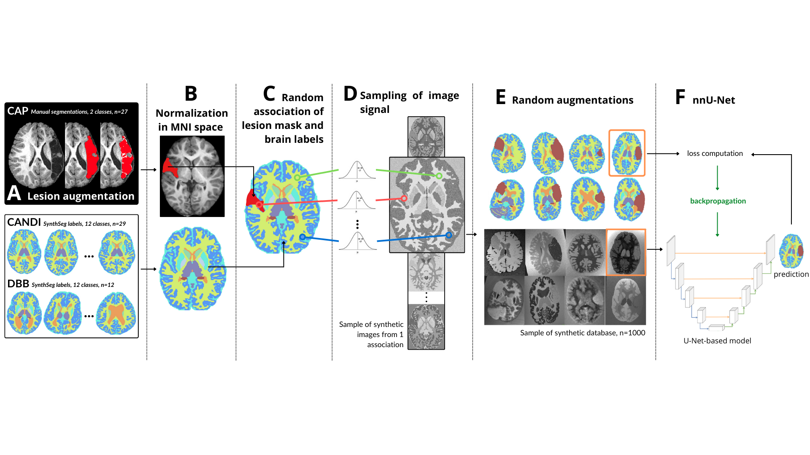

# Synthseg-lesion
Using synthseg approach to generate synthetic brains with lesions from labels for whole brain segmentation tasks. 



Based on the [following paper](https://hal.science/hal-05123560): 

    Emma Lhermitte, Romain Valabregue, Mickael Dinomais, Rodrigo Araneda, Yannick Bleyenheuft, et al.. Synthetic learning: a novel approach for segmenting structures in children brains with perinatal stroke. 2025. ⟨hal-05123560⟩ 


# Installation instructions
Clone the repository :
```bash
git clone https://github.com/emlhe/Synthseg-lesion.git
cd Synthseg-lesion
pip install -e .
```


